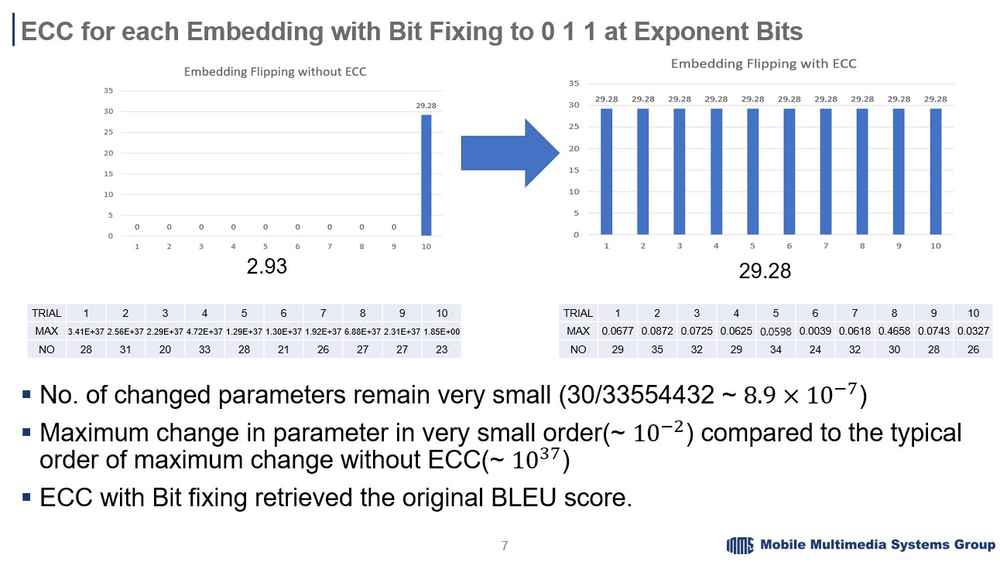

# Bitflip-Evaluator

  
Image of performance recovery using Hamming (7,4) to correct the errors made by random bit flip.

This project was done to figure out how performance degradation of transformer model based translator [Fairseq](https://github.com/facebookresearch/fairseq) due to random bitflip can be recovered by Hamming (7,4) using the 7 bits of the exponent of each bfloat16 number. 
The actual bitflip was done by using CUDA code to randomly flip the bits of each bfloat16 number in the embedding layer, the other layers, activations, while the correction was done by using hamming.py and hamming2.py
generate.py is an edited version of original fairseq generate.py module, which reflects how random bitflip module that was created by CUDA coding called rflip was used to flip the bits.

# License
[MIT](https://choosealicense.com/licenses/mit/)
